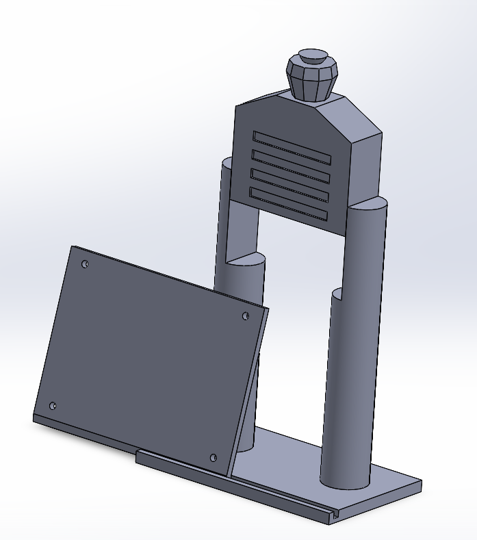

# Boston Logan Control Tower

Also viewable on [MakerWorld](https://makerworld.com/en/models/410275)

A 3D printable mount for the SkyPortal, compatible with the original PyPortal form factor. The PyPortal is mounted to the mounting plate using M2.5 x 4mm screws (4x),  M2.5 x 6mm screws (4x), and M2.5 x 6mm standoffs (4x).

