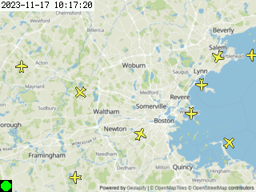

# skyportal
[](https://github.com/sco1/skyportal/releases)
[](https://github.com/sco1/skyportal/blob/main/LICENSE)
[](https://results.pre-commit.ci/latest/github/sco1/skyportal/main)

A CircuitPython based flight tracker powered by [Adafruit](https://io.adafruit.com/), [Geoapify](https://www.geoapify.com/), [ADSB.lol](https://adsb.lol), and [The OpenSky Network](https://opensky-network.org/).

Heavily inspired by Bob Hammell's PyPortal Flight Tracker ([GH](https://github.com/rhammell/pyportal-flight-tracker), [Tutorial](https://www.hackster.io/rhammell/pyportal-flight-tracker-0be6b0#story)).

Thank you to [markleoart](https://www.fiverr.com/markleoart) for creating the aircraft icon sprite sheets!

 

## Supported Hardware Configurations
Compatibilty is guaranteed for the following hardware configurations:
* [Adafruit PyPortal](https://www.adafruit.com/product/4116)
* [FeatherS3](https://www.adafruit.com/product/5399) + [FeatherWing V2 w/TSC2007](https://www.adafruit.com/product/3651)

## Getting Started
Users are assumed have read through [Adafruit's PyPortal learning guide](https://learn.adafruit.com/adafruit-pyportal). CircuitPython v9.2 is currently in use for this repository, no other versions are evaluated & reverse compatibility is not guaranteed.

The CircuitPython libraries in `lib` are sourced from the Official and Community bundles, which can be found on the [CircuitPython libraries page](https://learn.adafruit.com/adafruit-pyportal). Compatibility for a given SkyPortal release is only ensured with library files vendored by this repository.

**WARNING:** In order to generate the background map tile, this project's `boot.py` modifies the boot process to allow the filesystem to be used as a writeable cache. In the unlikely event that things go horribly awry you may lose the existing contents of your device, so be sure to back them up before working with this project.

### Installation
#### From Source
To get up and running, copy the following files from the repository to your PyPortal:

```
assets/
lib/<your hardware configuration>/lib
skyportal/
boot.py
code.py
pyportal_startup.bmp
pyportal_startup.wav
secrets.py
skyportal_config.py
```

**NOTE:** As of Skyportal v2.0 there are some hardware-specific file configurations that need to be adjusted for proper functionality:
* The sample default map tile provided by the repository is marked with a hardware suffix (screen pixel sizes differ). If using the sample map tile, rename the hardware-appropriate `*.bmp` file to `default_map.bmp` and delete the other tile. This does not have an effect if querying Geoapify for the map tile, though this default map is used as the fallback if this query fails.
* The bundled CircuitPython libraries are separated by hardware type, copy the **nested** `lib` file for your hardware configuration to the root of your device.

#### From GH Release
The Skyportal [Releases page](https://github.com/sco1/skyportal/releases) contains bundled `*.tar.gz` archives, built in CI, that can be downloaded and extracted directly onto the device. Bundles are available for each supported hardware configuration and come in two flavors: a pure-python implementation and a compiled version, where the `skyportal` library has been [compiled to `*.mpy`](https://learn.adafruit.com/welcome-to-circuitpython/library-file-types-and-frozen-libraries#dot-mpy-library-files-3117643) and added to `lib/`.

### Configuration
#### Secrets
The following secrets are required for functionality:

```py
secrets = {
    # Your local timezone, see: http://worldtimeapi.org/timezones
    "timezone": "America/New_York",
    # WIFI information
    "ssid": "YOUR_SSID",
    "password": "YOUR_WIFI_PASSWORD",
    # Geoapify, used to generate static mapping
    "geoapify_key": "YOUR_GEOAPIFY_API_KEY",
    # Adafruit IO, used for transient image hosting & local time lookup
    "aio_username" : "YOUR_AIO_USERNAME",
    "aio_key" : "YOUR_AIO_KEY",
    # Open Sky Network credentials, for getting flight information
    # Can be omitted if not using OpenSky
    "opensky_username": "YOUR_OPENSKY_USERNAME",
    "opensky_password": "YOUR_OPENSKY_PASSWORD",
    # Proxy API Gateway credentials
    # Can be omitted if not using a proxy server
    "proxy_api_url": "YOUR_PROXY_API_URL",
    "proxy_api_key": "YOUR_PROXY_API_KEY",
}
```

#### Skyportal Configuration
A collection of functionality-related constants is specified in `skyportal_config.py`, which can be adjusted to suit your needs:

| Variable Name              | Description                                           | Default   |
|----------------------------|-------------------------------------------------------|-----------|
| `USE_DEFAULT_MAP`          | Use the default map image rather than query Geoapify  | `False`   |
| `MAP_CENTER_LAT`           | Map center latitude, decimal degrees                  | `42.41`   |
| `MAP_CENTER_LON`           | Map center longitude, deimal degrees                  | `-71.17`  |
| `GRID_WIDTH_MI`            | Map grid width, miles                                 | `15`      |
| `AIRCRAFT_DATA_SOURCE`     | Aircraft State API to utilize<sup>1</sup>             | `opensky` |
| `SKIP_GROUND`              | Skip drawing aircraft on the ground                   | `True`    |
| `GEO_ALTITUDE_THRESHOLD_M` | Skip drawing aircraft below this GPS altitude, meters | `20`      |

**Notes:**
1. See [Data Sources](#data-sources) for valid options

## Data Sources
### OpenSky-Network - `"opensky"`
Query the [OpenSky Network](https://opensky-network.org/) API. This requires a user account to be created & credentials added to `secrets.py`.

Information on their REST API can be found [here](https://openskynetwork.github.io/opensky-api/rest.html).

### ADSB.lol - `"adsblol"`
Query the [ADSB.lol](https://adsb.lol/). This currently does not require user authentication.

Information on their REST API can be found [here](https://api.adsb.lol/docs).

**NOTE:** This API provides a lot of interesting information in the state vector provided for each aircraft. Depending on the level of congestion in your query area, may be more data than can fit into RAM (See: [Known Limitations](#known-limitations)).

### Proxy API - `"proxy"`
Query a user-specified proxy server using the URL and API key provided in `secrets.py`.

For authentication, the API is assumed to expect an API key provided in the `"x-api-key"` header.

The proxy API is assumed to expect three parameters:
  * `lat`, center latitude, decimal degrees
  * `lon`, denter longitude, decimal degrees
  * `radius`, search radius, miles

The proxy API is expected to return two parameters:
  * `"ac"` - A list of state vectors, as dictionaries, whose kv pairs map directly to `skyportal.aircraftlib.AircraftState`
  * `"api_time"` - UTC epoch time, in seconds, may be a float

An example using ADSB.lol and AWS Lambda is provided by this repository in [`./adsblol-proxy`](./adsblol-proxy/README.md)


## Touchscreen Functionality
**NOTE:** Touchscreen input is mostly limited to one touch event per screen tap, rather than continuously firing while the screen is being touched.

**NOTE:** Due to the lack of an available asynchronous requests library for CircuitPython, web calls are blocking and will block touchscreen functionality until a response is obtained. A UI element in the lower left corner notifies the user whether or not the screen is currently able to process touch inputs.

### Aircraft Information
Tapping on an aircraft icon will display state information for the aircraft closest to the registered touch point; this lookup is thresholded to a maximum distance of 30 pixels from the touch point. There is currently no method to disambiguate between aircraft that are in very close proximity.

## Known Limitations
The PyPortal is a highly memory constrained environment, which presents challenges when aiming to create a highly expressive UI. While every attempt is being made to minimize memory usage to keep the Skyportal functioning, the device may occasionally run out of memory. The most likely point for this to happen is when receiving the web request with aircraft state information from your API of choice. Depending on how congested your selected airspace is at query time, there may simply be too much information provided by the API for the device to handle & I've intentionally left the exception unhandled so it will crash the device. Should you find this ocurring often, you may be interested in setting up a proxy server to return only the information needed for the device to function, which can significantly alleviate the amount of RAM needed. See [Proxy API](#proxy-api---proxy) for more information.

Depending on board configuration, the FeatherS3 typically has more RAM avilable to accomodate these web requests, so Skyportal v2.0 expands functionality to serve this board type.
